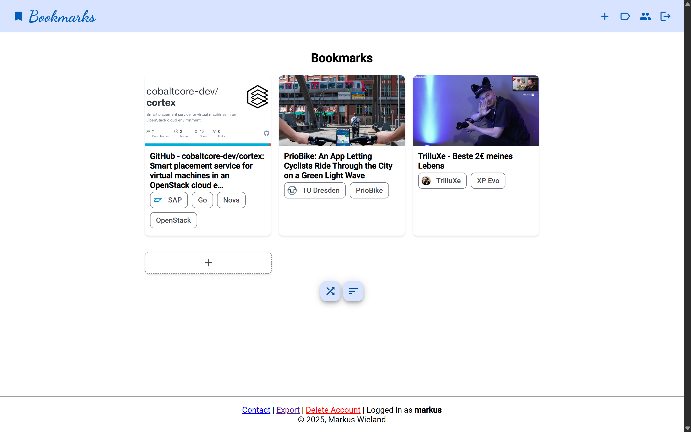

# Bookmarks

This is a simple app to manage bookmarks (articles, clips, videos) from multiple platforms. Easily save and organize your favorite links, with automatic extraction of meta tags from URLs for details like title, thumbnail, and duration.

With this app, you can quickly add bookmarks from anywhere on the web, categorize them, and search through your collection with ease. The platform supports a variety of content types, making it ideal for keeping track of interesting articles, memorable videos, and useful resources. Meta information is fetched automatically.



## Getting Started

1. Create a `.env` file based on the provided example.
2. Build the Docker image:

   ```sh
   docker build -t bookmarks-app .
   ```

3. Run the Docker container:

   ```sh
   docker run -p 3000:<port_from_env> bookmarks-app
   ```

   This will start the backend server on port 3000.  
   You can adjust the port mapping as needed.

## Development

1. Run `npm run setup`
2. Run `npm run dev:all`
